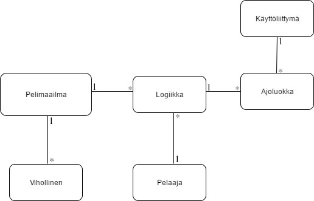

# DungeonCrawler

### Lyhyt kuvaus:
Yksinkertainen vuoropohjainen luolastoroolipeli.

## Dokumentaatio
[aiheen kuvaus](Dokumentaatio/aiheenKuvausJaRakenne.md)

[tuntikirjanpito](Dokumentaatio/tuntikirjanpito.md)

[checkstyle-raportti](https://htmlpreview.github.io/?https://github.com/nybejonn/DungeonCrawler/blob/master/Dokumentaatio/checkstyle/checkstyle.html)

[pit-raportti](https://htmlpreview.github.io/?https://github.com/nybejonn/DungeonCrawler/blob/master/Dokumentaatio/pit/201706281337/index.html)

[JavaDoc](https://htmlpreview.github.io/?https://github.com/nybejonn/DungeonCrawler/blob/master/JavaDoc/index.html)
